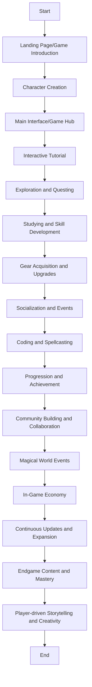

# The Wizard Amigos Quest in the Magical Realm of Amigonia

## Introduction
- Landing Page/Game Introduction
  - Welcome message introducing players to the game's concept and world.
  - Brief overview of the game's objectives and features.
  - Interactive elements for players to start the game, such as creating their wizard character and choosing an avatar.

## Gameplay Flow
- Character Creation
  - Players create their wizard character by choosing their appearance, name, and customizing colors.
  - Introduction to the nomadic lifestyle of Wizard Amigos and their quest in the magical realm. (all about wizard amigos could be covered out here)
- Main Interface/Game Hub
  - The main interface serves as the central hub for players to navigate the game.(operating system VR desktop or hologram or XR style such apple vision pro) or it could be like city in holographic style.
  - Access to various game features and activities, such as studying, questing/exploring, bonding, buying stuff, and crafting.
- Interactive Tutorial
  - New players are guided through an interactive tutorial to familiarize themselves with game mechanics and controls.
  - Introduction to basic actions such as opening the omni bag, using the realm ring, and accessing the time lens/orb.
- Exploration and Questing
  - Players embark on quests to explore new realms and dimensions within the magical realm of Amigonia.
  - Quests involve interacting with NPCs, solving codes, and overcoming challenges to unlock new abilities, getting rewards and progress in the game.
- Studying and Skill Development
  - Players have the opportunity to study and learn new magical spells and skills.
  - Access to magical libraries (if we have any prerecorded courses), schools(live solving problems like leetcode), or special places where players can acquire knowledge and enhance their abilities.
- Gear Acquisition and Upgrades
  - Players visit the wizard gear stall to acquire essential items such as the omni bag, realm ring, and other magical gear.
  - Opportunities to upgrade gear and acquire new items through quests and achievements.
- Socialization and Events
  - Players interact with other Wizard Amigos through virtual portals or magical meeting spaces. (meetup part will be covered here)
  - Participation in events such as code camps, meetups, and workshops to learn, collaborate, and socialize with fellow wizards.
- Coding and Spellcasting
  - Integration of coding activities into the game, where players can customize code to cast spells and perform magical actions in return they can get some kind of magic coins or anything similar to it in wizard world.
  - Use of magic items such as the magic book or wand to access a real code editor and experiment with coding spells.
- Progression and Achievement
  - Players earn experience points (XP) by completing quests, learning new skills, and participating in events.
  - Leveling up unlocks new abilities, gear upgrades, and access to advanced quests and challenges.
  - Also can introduce ranking system where on getting certain number of XP makes you rank higher with higher you get more rewards and recognitions.(we can discuss on this further)
- Community Building and Collaboration
  - Encouragement of collaboration and community building among players through activities such as teaching, mentoring, and volunteering.
  - Participation in community events and activities aimed at fostering connections, building friendships, and strengthening bonds within the Wizard Amigos community.
- Magical World Events
  - Regularly scheduled in-game events that reflect real-life events or special occasions within the magical realm.
  - Players can participate in festivals, celebrations, and special quests that offer unique rewards and challenges. (timeline could be covered out here)
- In-Game Economy
  - Introduction of an in-game economy where players can earn currency or resources through quests, activities, and contributions to the community. (As mentioned earlier it could be anything magic coin or anything else we could discuss on it)
- Continuous Updates and Expansion
  - Regular updates and expansions to introduce new content, features, and challenges to keep the game fresh and engaging.
  - Community feedback and suggestions are taken into account to shape the direction of future updates and improvements.
- Endgame Content and Mastery
  - As players progress through the game, they unlock access to endgame content and challenges that test their mastery of magical skills and abilities. (it gets harder with each steps)
  - Ultimate quests and achievements await those who reach the highest levels of wizardry, offering prestigious rewards and recognition within the community.
- Player-driven Storytelling and Creativity
  - Emphasis on player-driven storytelling and creativity, allowing players to shape their own narratives and adventures within the magical realm. (they can choose what they want to do.)
  - Tools and features for players to create and share their own quests, stories, and experiences with the community.

## Breaking down how each part contributes to the main categories of playing a wizard character in the game

### Learning & Coding:
In the game, players will encounter magical challenges that require them to write spells using a [coding interface1a](https://www.pinterest.com/pin/539798705352233117/). For example, they might need to write a spell to create a [protective barrier1b](https://www.pinterest.co.uk/pin/539798705352333844/) around themselves or to conjure a [magical creature2a](https://www.pinterest.com/pin/539798705352232617/)/[magical creature2b](https://www.pinterest.co.uk/pin/539798705352333838/)  to aid them in their quest.

Players can also [collaborate on coding projects3b](https://www.pinterest.co.uk/pin/539798705352312309/) within the game. They might join forces with other players to create a magical library of spells, contribute to an open-source magical framework, or even establish a virtual company to develop magical applications for the [wizarding community4b](https://www.pinterest.co.uk/pin/539798705352327075/).

#### [From Main Moodboard](https://www.pinterest.com/serapath/wizard-page-next/?invite_code=fff7da246acd46bdaa7f309a11411504&sender=910642124561769093): 
 - 1a. [coding interface](https://www.pinterest.com/pin/539798705352233117/): Interface could look like this modern tab or window vr style. Or we could go with ancient [wood style](https://www.pinterest.com/pin/539798705352232746/) or use [book](https://www.pinterest.com/pin/539798705352232717/) as an interface.
 - 2a. [magical creature](https://www.pinterest.com/pin/539798705352232617/): This magical creature could have there own unique power or an ability to help with quest.

#### [From Inspiration Moodboard](https://www.pinterest.co.uk/serapath/finalwiz/)
- 1b. [protective barrier](https://www.pinterest.co.uk/pin/539798705352333844/): We can create some opposing thing for example if player fail in quest he might lose some health or xp. On activation of protective barrier it might help to slow down the health loss.
- 2b. [magical creature](https://www.pinterest.co.uk/pin/539798705352333838/): This is another way magical creature could be represented.
- 3b. [collaborate on coding projects](https://www.pinterest.co.uk/pin/539798705352312309/): We can create a virtual VR environment through which multiple players could connect and start working on single projects collaboratively. 
- 4b. [wizarding community](https://www.pinterest.co.uk/pin/539798705352327075/): This type of discord style communication screen could be created so that user could communicate with eachother through it and it will increase interaction between players to keep them engage.

### Magical Nomadism:
As players explore different regions of the [magical realm1b](https://www.pinterest.co.uk/pin/539798705352312761/), they'll need to navigate various modes of transportation, such as [flying on broomsticks2b](https://www.pinterest.co.uk/pin/539798705352319772/), teleporting through [magical portals3b](https://www.pinterest.co.uk/pin/539798705352318845/), or some kind of [bubble4b](https://www.pinterest.co.uk/pin/539798705352319776/) mentioned earlier.

Players will encounter challenges related to finding suitable accommodation in [different environments1a](https://www.pinterest.com/pin/539798705352232650/). For example, they might need to set up magical tents in the [enchanted forest5b](https://www.pinterest.co.uk/pin/539798705352312784/), find shelter in [hidden caves6b](https://www.pinterest.co.uk/pin/539798705352312371/) in the mountains, or seek refuge in [floating cities7b](https://www.pinterest.co.uk/pin/539798705352316312/) in the sky.

In terms of gear and equipment, players will acquire magical items that aid them in their nomadic lifestyle. These could include enchanted backpacks with limited storage space, multi-functional tools like the omni bag, or protective gear imbued with magical properties.

#### [From Main Moodboard](https://www.pinterest.com/serapath/wizard-page-next/?invite_code=fff7da246acd46bdaa7f309a11411504&sender=910642124561769093): 
 - 1a. [different environments](https://www.pinterest.com/pin/539798705352232650/): we could create different seasons or environment ui or illustration in our game which changes based on player location (if it is possible). 

#### [From Inspiration Moodboard](https://www.pinterest.co.uk/serapath/finalwiz/)
- 1b. [magical realm](https://www.pinterest.co.uk/pin/539798705352312761/):When I first started working on the documentation as I mentioned about flying rock this was in my mind. As mentioned we should skip flying rock we can ulter this one a little bit make it into hidden forest vibe (this idea came into my mind from documentatory on inhabitant of amazon rainforest).
- 2b. [flying on broomsticks](https://www.pinterest.co.uk/pin/539798705352319772/): This could one form of transportation but if we are going toward more cyberpunk and futuristic style this will not match well.
- 3b. [magical portals](https://www.pinterest.co.uk/pin/539798705352318845/): A portal that connect with another dimension in our case connecting wizard amigos with dat-ecosystem or playproject.io.
- 4b. [bubble](https://www.pinterest.co.uk/pin/539798705352319776/): Instead of broomstick we could go with this more modern style of bubble transportation.
- 5b. [enchanted forest](https://www.pinterest.co.uk/pin/539798705352312784/): we could use something similar to this big tree somewhere in our project.
- 6b. [hidden caves](https://www.pinterest.co.uk/pin/539798705352312371/): This might look more like big tunnel than cave but just to convey idea we could make it look like hidden cave somehow used as an accommodation.
- 7b. [floating cities](https://www.pinterest.co.uk/pin/539798705352316312/): This was exactly what I meant from floating city(we can skip this one just for the reference what I meant by floating city).

### Healthy Lifestyle:
Throughout their adventures, players will come across opportunities to engage in activities that promote a [healthy lifestyle1a](https://www.pinterest.com/pin/539798705352232614/). For instance, they might attend virtual yoga sessions to improve their [flexibility and mindfulness1b](https://www.pinterest.co.uk/pin/539798705352333860/), participate in magical cooking classes to learn how to prepare [nutritious meals or drinks2a](https://www.pinterest.com/pin/539798705352232622/), or embark on [nature walks2b](https://www.pinterest.co.uk/pin/539798705352378611/) to rejuvenate their spirits.

The game will reward players for adopting healthy habits, such as consuming magical fruits and vegetables for increased health points, practicing [meditation3b](https://www.pinterest.co.uk/pin/539798705352332497/) to boost mental clarity, or engaging in physical activities like flying races or [dueling tournaments4b](https://www.pinterest.co.uk/pin/539798705352378604/) to enhance their [magical prowess3a](https://www.pinterest.com/pin/539798705352236309/).

#### [From Main Moodboard](https://www.pinterest.com/serapath/wizard-page-next/?invite_code=fff7da246acd46bdaa7f309a11411504&sender=910642124561769093): 
 - 1a. [healthy lifestyle](https://www.pinterest.com/pin/539798705352232614/): Magic mashrooms could be one source to live healthy life in the world of wizards.
 - 2a. [nutritious meals or drinks](https://www.pinterest.com/pin/539798705352232622/): If we want to we could find some magical food but I really have no idea exactly how we would be able to mix meals and drinks with the theme of our game.
 - 3a. [magical prowess](https://www.pinterest.com/pin/539798705352236309/): On consumption of magic meals or drinks or performing health related actions described above player could be rewarded with powers etc.

#### [From Inspiration Moodboard](https://www.pinterest.co.uk/serapath/finalwiz/)
- 1b. [flexibility and mindfulness](https://www.pinterest.co.uk/pin/539798705352333860/): Meditation, yoga etc. could be one source of healthy living.
- 2b. [nature walks](https://www.pinterest.co.uk/pin/539798705352378611/): How virtually walking will help player mindfulness we might have to think for this.
- 3b. [meditation](https://www.pinterest.co.uk/pin/539798705352332497/): as mentioned above this could be one source of healthy living.
- 4b. [dueling tournaments](https://www.pinterest.co.uk/pin/539798705352378604/): players could get together to help eachother with tasks to earn magical powers.

### Activist Community of Wizards:
Within the game, players will have the chance to become involved in various activist initiatives and [community-building1b](https://www.pinterest.co.uk/pin/539798705352319781/) efforts. They might volunteer their time to help clean up polluted [magical forests2b](https://www.pinterest.co.uk/pin/539798705352312787/), organize [educational workshops3b](https://www.pinterest.co.uk/pin/539798705352312298/) to promote diversity and inclusion among wizards, or mentor younger players to help them develop their [magical skills1a](https://www.pinterest.com/pin/539798705352232627/).

Players can also earn experience points by advocating for [social justice2a](https://www.pinterest.com/pin/539798705352232621/) and environmental sustainability within the [game world4b](https://www.pinterest.co.uk/pin/539798705352312385/). For example, they might participate in protests against the exploitation of magical creatures, support initiatives to conserve magical habitats, or collaborate on projects aimed at creating more equitable access to magical resources for all wizards.

#### [From Main Moodboard](https://www.pinterest.com/serapath/wizard-page-next/?invite_code=fff7da246acd46bdaa7f309a11411504&sender=910642124561769093): 
 - 1a. [magical skills](https://www.pinterest.com/pin/539798705352232627/): There could be somekind of notes or book every player to have with them where whatsoever they learn are noted down there. If they want to through that book they can help new players.
 - 2a. [social justice](https://www.pinterest.com/pin/539798705352232621/): They could bring diversity and equal rights. Or speak against injustice.

#### [From Inspiration Moodboard](https://www.pinterest.co.uk/serapath/finalwiz/)
- 1b. [community-building](https://www.pinterest.co.uk/pin/539798705352319781/): community of wizards belonging from the different background.
- 2b. [magical forests](https://www.pinterest.co.uk/pin/539798705352312787/): Speaking of magic forest this was the initial thing that comes to my mind.
- 3b. [educational workshops](https://www.pinterest.co.uk/pin/539798705352312298/): In educational workshops they could learn from eachother or build something toeg
- 4b. [game world](https://www.pinterest.co.uk/pin/539798705352312385/): How about we have something similar looking map to navigate different part of wizard world in our game.

##  transportation options and gear/equipment mechanics

### Transportation and Portals:
Wizards have access to various modes of transportation, each with its unique characteristics and benefits:

1. **[Broomsticks1b](https://www.pinterest.co.uk/pin/539798705352312828/)**: broomsticks allow wizards to fly through the skies with agility and speed. Players can soar above the enchanted landscapes, discovering hidden secrets and navigating obstacles from above.

2. **[Magical Portals1a](https://www.pinterest.com/pin/539798705352235016/)**: These mystical gateways connect [different regions and dimensions2a](https://www.pinterest.com/pin/539798705352236328/) within the magical realm. Players can use the [realm ring2b](https://www.pinterest.co.uk/pin/844493673168126/), a magical artifact, to open and configure [portals3b](https://www.pinterest.co.uk/pin/539798705352378616/) to desired locations. Once inside a portal, players can teleport to other realms or main world places, although some portals may require time to transition through.

3. **[Wizard Bubble4b](https://www.pinterest.co.uk/pin/539798705352319784/)**: Wizards can conjure large magical bubbles that float above the ground, serving as mobile shelters and transportation vessels. Players can ride inside these bubbles, floating effortlessly across the landscape and exploring hard-to-reach places. The wizard bubble provides protection from environmental hazards and allows players to rest and recharge during their travels.

4. **[Walking5b]([https:/](https://www.pinterest.co.uk/pin/539798705352312892/)/)**: For shorter distances or when exploring confined spaces like magical forests or hidden caves, walking remains a reliable method of transportation. It allows players to immerse themselves fully in the magical world, discovering hidden treasures and interacting with NPCs along the way.

#### [From Main Moodboard](https://www.pinterest.com/serapath/wizard-page-next/?invite_code=fff7da246acd46bdaa7f309a11411504&sender=910642124561769093): 
 - 1a. [Magical Portals](https://www.pinterest.com/pin/539798705352235016/): A portal that connects two different dimension (in our case connecting our different projects)
 - 2a. [different regions and dimensions](https://www.pinterest.com/pin/539798705352236328/): might be not best representation but if we create portal in our one website we might need to create one in our other projects as well like there should be a portal in playproject.io as well so they could travel from there to wizard amigos as well.

#### [From Inspiration Moodboard](https://www.pinterest.co.uk/serapath/finalwiz/)
- 1b. [Broomsticks](https://www.pinterest.co.uk/pin/539798705352312828/): This could one form of transportation but if we are going toward more cyberpunk and futuristic style this will not match well.
- 2b. [realm ring](https://www.pinterest.co.uk/pin/844493673168126/): we didn't had realm ring in our moodboards we might need to add some. (this was the random one I found in pinterest)
- 3b. [portals](https://www.pinterest.co.uk/pin/539798705352378616/): Another representation of how portal might look like.
- 4b. [Wizard Bubble](https://www.pinterest.co.uk/pin/539798705352319784/): Instead of broomstick we could go with this more modern style of bubble transportation.
- 5b. [Walking]([https:/](https://www.pinterest.co.uk/pin/539798705352312892/)/): if we going with first person view walking might not be the best suitable means of transport.

### Gear and Equipment:

1. **[Wizard Magic Stall1b](https://www.pinterest.co.uk/pin/539798705352333882/)**: The wizard magic stall serves as a clubhouse where wizards store and exchange gear and equipment. Players can visit the stall to pick up essential items for their journey or exchange items they no longer need. Since wizards live a nomadic lifestyle with limited carrying capacity, they must choose wisely which items to take with them.

2. **[Omni Bag2b](https://www.pinterest.com/pin/14003448832332870/)**: Each player starts with an omni bag, a magical backpack with limited storage capacity. The omni bag serves as the player's inventory, holding essential items such as the realm ring, potions, and magical artifacts. Players must manage their inventory carefully, prioritizing items based on their quest objectives and current needs.

3. **[Item Exchange System3b](https://www.pinterest.co.uk/pin/539798705352333837/)**: Wizards can exchange items with each other through the item exchange system. Players can offer items they no longer need in exchange for items they require for their journey. This fosters a sense of community and collaboration among players, as they help each other by sharing resources and equipment.

4. **Limited Capacity**: Since wizards cannot carry everything with them due to their [nomadic lifestyle1a](https://www.pinterest.com/pin/539798705352232603/), they must prioritize essential items and leave behind non-essential gear. This encourages players to make strategic decisions about which items to take on their quests and adventures.

5. **[Exploration and Discovery4b](https://www.pinterest.co.uk/pin/539798705352333887/)**: As players explore the magical realm, they may discover hidden caches of gear and equipment scattered throughout the landscape. These hidden treasures offer valuable resources and rewards to those who find them, incentivizing exploration and discovery in the game. like Easter eggs.

#### [From Main Moodboard](https://www.pinterest.com/serapath/wizard-page-next/?invite_code=fff7da246acd46bdaa7f309a11411504&sender=910642124561769093): 
 - 1a. [nomadic lifestyle](https://www.pinterest.com/pin/539798705352232603/)

#### [From Inspiration Moodboard](https://www.pinterest.co.uk/serapath/finalwiz/)
- 1b. [Wizard Magic Stall](https://www.pinterest.co.uk/pin/539798705352333882/): We might need to look for more stalls pin as well. this was one of the picture that matched best for now.
- 2b. [Omni Bag](https://www.pinterest.com/pin/14003448832332870/): Also we don't have any omni bags inspirations in our moodboard we might need to look for some.
- 3b. [Item Exchange System](https://www.pinterest.co.uk/pin/539798705352333837/): players could virtually through modern vr style hologram window they could exchange item with eachother.
- 4b. [Exploration and Discovery](https://www.pinterest.co.uk/pin/539798705352333887/): we might have to look for some modern futuristic style easter eggs or treasure box if we are going to include this part.

## List of "actions" or "activities" of the game when playing a wizard character

> **covered** means that this action or activity is somehow included into above proposal.
> **Uncovered** means that this action or activity is not covered in above proposal. 

---

### AVATAR
- **Covered**
- **Description**: [Avatar creation1a](https://www.pinterest.co.uk/pin/539798705352233114/) is part of the character creation process where players can choose their [appearance1b](https://www.pinterest.co.uk/pin/539798705352327094/), name, and customize colors(Color could be of background color or borders of the [avatar frame2b](https://www.pinterest.com/pin/76983474875887131/)).
- **Relation with other parts**: Avatar selection would be first part of the game and this avatar would represent players all over the game such as study, bonding etc.
- **Example**: Players can select from a variety of hairstyles, facial features, clothing options, and magical accessories to personalize their avatar. They can also choose a unique wizard name that reflects their personality or play style. For initial part we could adjust with our existing characters. Players could also use their own pictures as an avatar.

#### [From Main Moodboard](https://www.pinterest.com/serapath/wizard-page-next/?invite_code=fff7da246acd46bdaa7f309a11411504&sender=910642124561769093): 
 - 1a. [Avatar creation](https://www.pinterest.co.uk/pin/539798705352233114/): This might not be exact avatar creation pin but we could use something similar like our character in the center and we could customize it by tabs or button on each sides.

#### [From Inspiration Moodboard](https://www.pinterest.co.uk/serapath/finalwiz/)
- 1b. [appearance](https://www.pinterest.co.uk/pin/539798705352327094/): This pin exactly shows the information that I want to convey. we could include an option whether player want to choose our avatars or use there pictures instead. 
- 2b. [avatar frame](https://www.pinterest.com/pin/76983474875887131/): If we are going with first person view then we would be required to have profile avatar on our screen in any of the corner for which we might be required to have frames. I was not able to find any in our moodboard so I have included this one.

---

### STUDY

- **Covered**
- **Description**: Players have the opportunity to study and learn new [magical spells1b](https://www.pinterest.co.uk/pin/539798705352319769/) and skills by accessing [magical libraries2b](https://www.pinterest.co.uk/pin/539798705352332449/), [schools3b](https://www.pinterest.co.uk/pin/539798705352378619/), or [special places4b](https://www.pinterest.co.uk/pin/539798705352378622/).
- **Relation with other parts**: This would be the most important part of the game. It would necessary for the user to study and learn to go further in game. All of the skills learned in study part would be used in quest. Study would also be important for the bonding if players want to mentor other wizards or take part in cooperative quests.
- **Example**: In the magical library, players can browse through [ancient tomes5b](https://www.pinterest.co.uk/pin/539798705352333896/) and [scrolls6b](https://www.pinterest.co.uk/pin/539798705352333884/) to learn spells like [levitation7b](https://www.pinterest.co.uk/pin/539798705352333863/), [elemental manipulation8b](https://www.pinterest.co.uk/pin/539798705352318989/), or [illusion casting9b](https://www.pinterest.co.uk/pin/539798705352319046/). They can also attend live classes at the [School of Wizardry10b](https://www.pinterest.co.uk/pin/539798705352319039/), where [skilled instructors11b](https://www.pinterest.co.uk/pin/539798705352319038/) guide them through practical exercises and magical theory.

#### [From Inspiration Moodboard](https://www.pinterest.co.uk/serapath/finalwiz/)
- 1b. [magical spells](https://www.pinterest.co.uk/pin/539798705352319769/): As mentioned above this magical spells could be learned by attending schools, by senior or self study (by solving quests and puzzles) 
- 2b. [magical libraries](https://www.pinterest.co.uk/pin/539798705352332449/): Magic library could be included all of our old courses etc.
- 3b. [schools](https://www.pinterest.co.uk/pin/539798705352378619/): Mentor teaching the young wizards (new players) how to cast there spells properly.
- 4b. [special places](https://www.pinterest.co.uk/pin/539798705352378622/): This is one of the way special place is represented. Special place could be anything meeting with special wizard or learning through exploration. So study cuold be done in a lot of ways.
- 5b. [ancient tomes](https://www.pinterest.co.uk/pin/539798705352333896/): Ancient tome could contain hint about quests or it could contain codes to solve.
- 6b. [scrolls](https://www.pinterest.co.uk/pin/539798705352333884/): Same as ancient tomes.
- 7b. [levitation](https://www.pinterest.co.uk/pin/539798705352333863/): This could be one of the ability wizards could learn which can help them travel faster maybe.
- 8b. [elemental manipulation](https://www.pinterest.co.uk/pin/539798705352318989/): If we are including some kind of battles as well in the game this could come into the help
- 9b. [illusion casting](https://www.pinterest.co.uk/pin/539798705352319046/): same as above
- 10b. [School of Wizardry](https://www.pinterest.co.uk/pin/539798705352319039/): Players from different background could join wizard school there would be no restriction.
- 11b. [skilled instructors](https://www.pinterest.co.uk/pin/539798705352319038/): Old Wizard mentor that will guide young wizard with his knowledge and experience.

---

### QUEST
- **Covered**
- **Description**: Players embark on quests to explore [new realms1b](https://www.pinterest.co.uk/pin/539798705352319560/), interact with NPCs, and overcome challenges to progress in the game.
- **Relation with other parts**: To move further in game it would be necessary to complete quests and this quest would not be able to complete if wizards has not completed or taken part in **study** action. Also quest would be included in bonding section as well where groups of wizards would cooperatively work on quest.
- **Example**: Players might receive a quest to rescue a kidnapped wizard from a [dark forest inhabited2b](https://www.pinterest.co.uk/pin/539798705352312359/) by mythical creatures. Along the way, they must [solve puzzles3b](https://www.pinterest.co.uk/pin/539798705352319175/), [defeat enemies4b](https://www.pinterest.co.uk/pin/539798705352378623/), and uncover clues to unravel the mystery behind the kidnapping and earn valuable [rewards5b](https://www.pinterest.co.uk/pin/539798705352233170/).

#### [From Inspiration Moodboard](https://www.pinterest.co.uk/serapath/finalwiz/)
- 1b. [new realms](https://www.pinterest.co.uk/pin/539798705352319560/): 
- 2b. [dark forest inhabited](https://www.pinterest.co.uk/pin/539798705352312359/):
- 3b. [solve puzzles](https://www.pinterest.co.uk/pin/539798705352319175/):
- 4b. [defeat enemies](https://www.pinterest.co.uk/pin/539798705352378623/):
- 5b. [rewards](https://www.pinterest.co.uk/pin/539798705352233170/):

---

### BOND
- **Covered**
- **Description**: Players can interact with other Wizard Amigos through [virtual portals1b](https://www.pinterest.co.uk/pin/539798705352333796/) or magical meeting spaces, fostering connections and building friendships.
- **Related with other parts**: As defined in quest part bonding has relation in both study and quest section. It also has relation with exploration wizards(if we consider each wizards lives in different dimension) can visit eachothers dimension through portal generated by realm ring. 
- **Example**: Players can form bonds with other wizards by participating in group activities such as cooperative quests, [magical tournaments1a](https://www.pinterest.co.uk/pin/539798705352236293/), or social events like [wizard parties2b](https://www.pinterest.co.uk/pin/539798705352319048/) or gatherings. They can also communicate through magical messages or voice chats to coordinate their adventures.

#### [From Main Moodboard](https://www.pinterest.com/serapath/wizard-page-next/?invite_code=fff7da246acd46bdaa7f309a11411504&sender=910642124561769093): 
 - 1a. [magical tournaments](https://www.pinterest.co.uk/pin/539798705352236293/):

#### [From Inspiration Moodboard](https://www.pinterest.co.uk/serapath/finalwiz/)
- 1b. [virtual portals](https://www.pinterest.co.uk/pin/539798705352333796/): 
- 2b. [wizard parties](https://www.pinterest.co.uk/pin/539798705352319048/):

---

### EXPLORE
- **Covered**
- **Descriptions**: Exploration is a key aspect of the game, with players venturing into [new realms and dimensions1b](https://www.pinterest.co.uk/pin/539798705352378615/) within the magical realm. This dimension could be visiting another website or other community wizard profile.
- **Relation with other parts**: Exploration part would be later unlocked when wizard learn some skills to open portal and solve some quest or should have some friend in bonding to visit there dimensions. 
- **Example**: Players can explore diverse landscapes such as enchanted forests, [mystical mountains2b](https://www.pinterest.co.uk/pin/539798705352319394/), ancient ruins, and underwater kingdoms(maybe). Each location is filled with hidden secrets, rare treasures, and unique challenges waiting to be discovered.

#### [From Inspiration Moodboard](https://www.pinterest.co.uk/serapath/finalwiz/)
- 1b. [new realms and dimensions](https://www.pinterest.co.uk/pin/539798705352378615/): 
- 2b. [mystical mountains](https://www.pinterest.co.uk/pin/539798705352319394/):

---
### GEAR
- **Covered**
- **Description**: Players can acquire essential items and gear from the [wizard gear stall1b](https://www.pinterest.co.uk/pin/323414817006821390/), including the omni bag, realm ring, and other magical gear.
- **Relation with other parts**: To explore or to bond wizard would be required to have necessary items without them they would not be able to perform such actions. So gear section covers that part.
- **Example**: Players can obtain a [powerful staff1a](https://www.pinterest.co.uk/pin/539798705352232611/) imbued with elemental magic from the [wizard gear stall1b](https://www.pinterest.co.uk/pin/323414817006821390/), allowing them to unleash spells and abilities in [battle2b](https://www.pinterest.co.uk/pin/539798705352378604/). They can also discover [potions2a](https://www.pinterest.co.uk/pin/539798705352232620/), and something similar that grant special bonuses or protection against magical threats.

#### [From Main Moodboard](https://www.pinterest.com/serapath/wizard-page-next/?invite_code=fff7da246acd46bdaa7f309a11411504&sender=910642124561769093): 
 - 1a. [powerful staff](https://www.pinterest.co.uk/pin/539798705352232611/):
 - 2a. [potions](https://www.pinterest.co.uk/pin/539798705352232620/):

#### [From Inspiration Moodboard](https://www.pinterest.co.uk/serapath/finalwiz/)
- 1b. [wizard gear stall](https://www.pinterest.co.uk/pin/323414817006821390/):
- 2b. [battle](https://www.pinterest.co.uk/pin/539798705352378604/):

---

### DREAM
- **Not Covered**
- **Descriptoin**: Dreaming or [envisioning future goals1b](https://www.pinterest.co.uk/pin/539798705352378603/) and aspirations could be integrated into the game's narrative or [character development1a](https://www.pinterest.co.uk/pin/539798705352236280/) process.
- **Relation with other parts**: This part could be used for the quest section for instance if any player is stuck in any quest and they are not able to move forward they could use dream action where in its dream some old wizard will help them to solve the quest or atleast provide hint how to solve.
- **Example**: Players might have dreams or visions of legendary wizards, mythical creatures that foreshadow their destiny or upcoming quests. These dreams serve as hints or clues to guide players on their journey and inspire them to pursue their goals.

#### [From Main Moodboard](https://www.pinterest.com/serapath/wizard-page-next/?invite_code=fff7da246acd46bdaa7f309a11411504&sender=910642124561769093): 
 - 1a. [character development](https://www.pinterest.co.uk/pin/539798705352236280/):

#### [From Inspiration Moodboard](https://www.pinterest.co.uk/serapath/finalwiz/)
- 1b. [envisioning future goals](https://www.pinterest.co.uk/pin/539798705352378603/): 

---

### CRAFT
- **Covered**
- **Description**: Crafting could be introduced as a gameplay mechanic where players can create [magical items1a](https://www.pinterest.co.uk/pin/539798705352232655/), potions, or [magical creatures1b](https://www.pinterest.co.uk/pin/539798705352378620/) using collected materials.
- **Relation with other parts**: From the skills learned from the study section players could use those skills and material he got in his omni page obtained from gear section. combining them they could craft some creature or potions etc which could be helpful for the quest.
- **Example**: Players can gather [rare herbs2b](https://www.pinterest.co.uk/pin/539798705352332483/), minerals, and magical essences from the wilderness to [craft potions of healing3b](https://www.pinterest.co.uk/pin/539798705352378646/), or somehting else like invisibility etc. They can also combine materials to forge powerful weapons, [armors4b](https://www.pinterest.co.uk/pin/539798705352333841/), etc. tailored to their play style and preferences.

#### [From Main Moodboard](https://www.pinterest.com/serapath/wizard-page-next/?invite_code=fff7da246acd46bdaa7f309a11411504&sender=910642124561769093): 
 - 1a. [magical items](https://www.pinterest.co.uk/pin/539798705352232655/):

#### [From Inspiration Moodboard](https://www.pinterest.co.uk/serapath/finalwiz/)
- 1b. [magical creatures](https://www.pinterest.co.uk/pin/539798705352378620/): 
- 2b. [rare herbs](https://www.pinterest.co.uk/pin/539798705352332483/):
- 3b. [craft potions of healing](https://www.pinterest.co.uk/pin/539798705352378646/):
- 4b. [armors](https://www.pinterest.co.uk/pin/539798705352333841/):

---

### SHARE
- **Covered**
- **Description**: Players can share their experiences, quests, and stories with the community through [in-game communication channels1b](https://www.pinterest.co.uk/pin/539798705352327075/).
- **Relation with other part**: This one would be quite similar to the bonding part but they could create community where they could help eachother or share news and info with eachother about wizards amigos or quests etc.
- **Example**: Players can write and publish their own magical journals or spellbooks documenting their adventures, discoveries, and achievements.

#### [From Inspiration Moodboard](https://www.pinterest.co.uk/serapath/finalwiz/)
- 1b. [in-game communication channels](https://www.pinterest.co.uk/pin/539798705352327075/): 

---

### FORGE
- **Covered**
- **Descriptoin**: Forging alliances, bonds, or friendships with other players is part of the [socialization 1b](https://www.pinterest.co.uk/pin/539798705352316176/) and community-building aspect of the game (similar to above).
- **Relation with other part**: This has a coorelation with all of the above sections.
- **Example**: They can also form wizarding guilds or societies with other players to collaborate on large-scale projects, events, or competitions (similar to [meetup](https://www.meetup.com/WizardAmigos/)).

#### [From Inspiration Moodboard](https://www.pinterest.co.uk/serapath/finalwiz/)
- 1b. [socialization](https://www.pinterest.co.uk/pin/539798705352316176/): 

---
### SUMMON
- **Not Covered**
- **Description**: The ability to [summon creatures 1b](https://www.pinterest.co.uk/pin/15270086236141946/) or entities could be introduced as a gameplay mechanic, allowing players to summon familiars, guardians, or elemental allies to aid them in battle or exploration.
- **Realtion with other parts**: To summon you would be required to learn from study section and you can share your secret recipe in share section. With your summoned power or creature you could use it to get help in quest.
- **Example**: Players can learn powerful summoning (learning part is covered in study section) spells to call forth mythical creatures such as phoenixes, magical birds,(included just random magic animal names) to assist them in combat or perform special tasks. Each summoned creature has its own unique abilities, strengths, and weaknesses, providing players with strategic options to overcome challenges and adversaries in the magical realm.

#### [From Inspiration Moodboard](https://www.pinterest.co.uk/serapath/finalwiz/)
- 1b. [summon creatures](https://www.pinterest.co.uk/pin/15270086236141946/):

