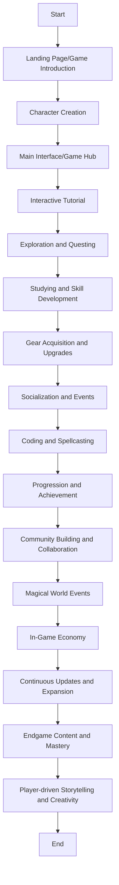

## Flow Chart

```mermaid
graph TD;
Start[Start] --> LandingPage[Landing Page/Game Introduction];
LandingPage --> CharacterCreation[Character Creation];
CharacterCreation --> MainInterface[Main Interface/Game Hub];
MainInterface --> InteractiveTutorial[Interactive Tutorial];
InteractiveTutorial --> ExplorationQuesting[Exploration and Questing];
ExplorationQuesting --> StudyingSkill[Studying and Skill Development];
StudyingSkill --> GearAcquisition[Gear Acquisition and Upgrades];
GearAcquisition --> SocializationEvents[Socialization and Events];
SocializationEvents --> CodingSpellcasting[Coding and Spellcasting];
CodingSpellcasting --> ProgressionAchievement[Progression and Achievement];
ProgressionAchievement --> CommunityBuilding[Community Building and Collaboration];
CommunityBuilding --> MagicalWorldEvents[Magical World Events];
MagicalWorldEvents --> InGameEconomy[In-Game Economy];
InGameEconomy --> ContinuousUpdates[Continuous Updates and Expansion];
ContinuousUpdates --> EndgameContent[Endgame Content and Mastery];
EndgameContent --> PlayerStorytelling[Player-driven Storytelling and Creativity];
PlayerStorytelling --> End[End];
```
