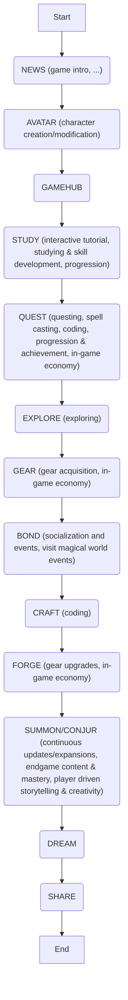

## Flow Chart

```mermaid
graph TD;
Start[Start] --> News("NEWS (game intro, ...)");
News --> Avatar("AVATAR (character creation/modification)");
Avatar --> GameHub("GAMEHUB");
GameHub --> Study("STUDY (interactive tutorial, studying & skill development, progression)");
Study --> Quest("QUEST (questing, spell casting, coding, progression & achievement, in-game economy)");
Quest --> Explore("EXPLORE (exploring)");
Explore --> Gear("GEAR (gear acquisition, in-game economy)");
Gear --> Bond("BOND (socialization and events, visit magical world events)");
Bond --> Craft("CRAFT (coding)");
Craft --> Forge("FORGE (gear upgrades, in-game economy)");
Forge --> SummonConjur("SUMMON/CONJUR (continuous updates/expansions, endgame content & mastery, player driven storytelling & creativity)");
SummonConjur --> Dream("DREAM");
Dream --> Share("SHARE");
Share --> End[End];


```
